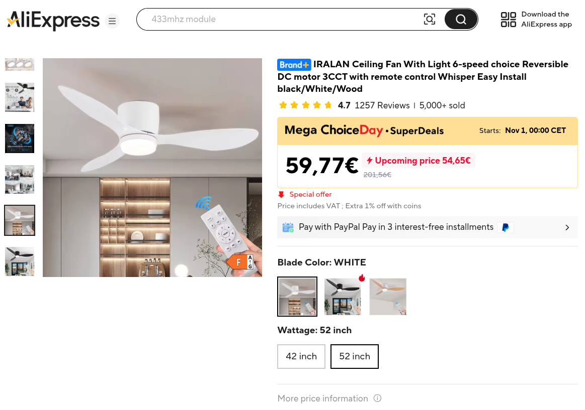
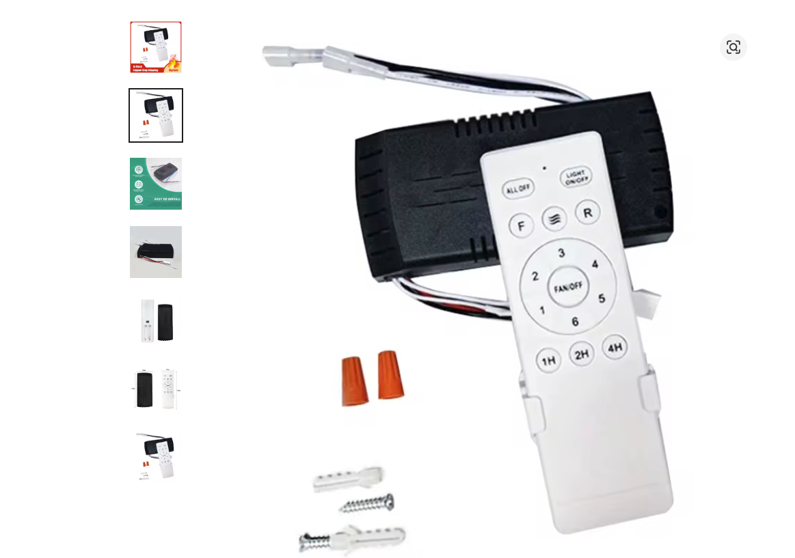
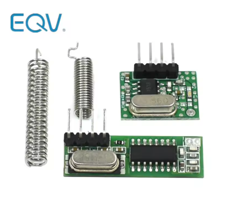

# Hacking a ceiling fan



## Motivation

I recently got a ceiling fan from Aliexpress, it has 6 speed settings and an LED light. All of it is controlled with a remote.



In order to "smartify" this ceiling fan, you have two options:

- Hack the actual controller, reverse engineering the board and putting an ESPHome device to trigger the signals. It should be doable (it's just 3+1 outputs), but it's messy and somewhat dangerous
- Clone the remote.

This repo describes the process for the second option.

## I just want the code

Unfortunately the remote is not universal, you need to do some decoding first

## Procedure

The remote is not infrarred, but rather 433MHz. In terms of hardware, it doesn't change that much; you just need to get a 433MHz receiver and transmitter



The wiring is pretty simple

- 5V -> VCC
- GND -> GND
- DATA -> Any GPIO. Depending on your ESP board, some GPIO might be tied to something like flash memory, or be unsafe to use as an input because it might mess with the boot process.

If your module has a "CS" or "EN" pin, you'll want to check the details but you'll most likely need to pull it high to get any data


ESPHome has a remote receiver component, but I found the output hard to read, so I suggest using the arduino example in `arduino/ReceiveDemo_Advanced.ino` . Once you've flashed that onto your esp device, you can trigger each button in the remote and you'll see something like this in the serial output:

```
Decimal: 3053912918 (32Bit) Binary: 10110110000001110000001101010110 Tri-State: not applicable PulseLength: 280 microseconds Protocol: 1
Raw data: 8669,754,272,254,742,754,272,738,271,255,742,754,271,738,273,253,743,269,743,268,742,270,742,270,742,270,742,753,270,740,270,739,271,253,744,271,741,268,743,270,742,270,742,269,742,753,271,740,271,254,742,754,271,254,743,754,271,255,742,755,269,740,271,256,737,
```

### Code dumping

The code used by these remotes is a rolling code, which means it's not just one unique code for each button but multiple. You will need to dump each button **8 times**. You only need to pay attention to the Binary output, but visualizing it in Hex is easier so the code in `bintohex.py` does just that

The codes for the remote follow the following structure:

- 5 nibbles for the "unique identifier" of the remote. Each remote will have a different identifier (that's how you can have multiple fans without one remote affecting them all)
- 1 nibble for the action
- 2 nibbles for the rolling code

The unique identifier is common to all the buttons in the same remote, the action is unique to each button (but it's already mapped in the example yaml) and the rolling code is the thing you actually care about.

After you've dumped all your codes, you can proceed to adjusting the yaml

### Adjusting the yaml

You will need to replace the value for the unique ID:

```
globals:
  # The unique identifier of the remote
  - id: identifier_livroom
    type: uint32_t
    initial_value: "0xB6070" # Replace this accordingly
```
And in each button template, the rolling codes. Note that we only care about the last byte

```
button:
  - platform: template
    name: "LivingRoom FanAndLight Off"
    id: "livingroom_fanandlight_off"
    on_press:
      - remote_transmitter.transmit_rc_switch_raw:
          <<: *remote_config
          code: !lambda |-
            static const std::vector<uint8_t> rolling_codes = {0x74, 0x03, 0x12, 0x21, 0x30, 0x47, 0x56, 0x65};
            return build_remote_code(id(identifier_livroom), id(button_all_off), rolling_codes, id(all_off_index_livroom));
```


### Making it work

Because of how the rolling code works, you might dump the values, try to trigger them with your new ESPHome device, and see that the controller doesn't respond. This is expected! The controller saves the last code it received (or rather, it knows what the next one should be), and when you first flash your firmware, your device is going to start at a different code. At this point you have two options:

- Some controllers will "forget" the last code (and thus expect any code next) if they lose power, so you can flip the breaker to reset the fan
- You can "prime" the ESP Transmitter by pressing the (template) button of your ESP transmitter multiple times until the controller responds. At that point, they should be synced. Note that if you do this, you have to do this for *every* button.

Once that is done, you can either keep using those buttons as if it was a dumb remote, or use the Fan component!


## Additional notes:


This has been tested with two copies of the same fan (with their own two remotes). With more data points, we might be able to get the algorithm it uses to generate the rolling code, so it might be possible to create a better component that only needs the unique identifier.

